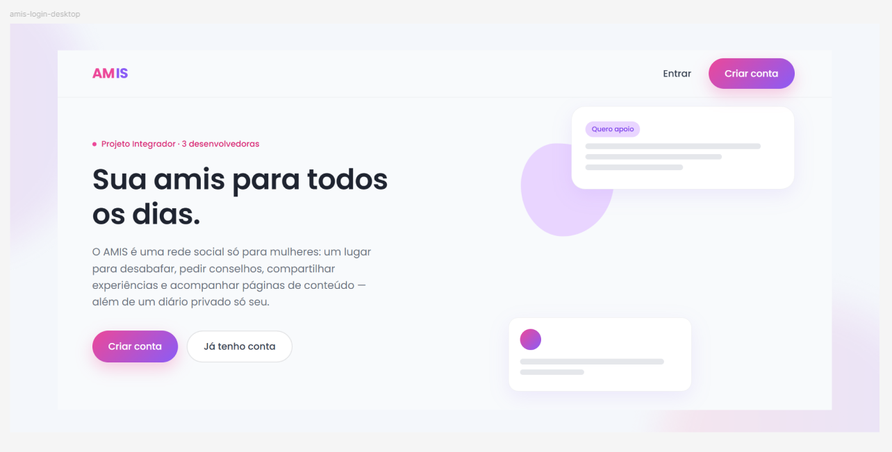
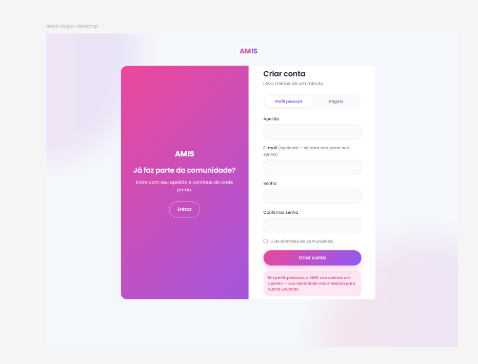
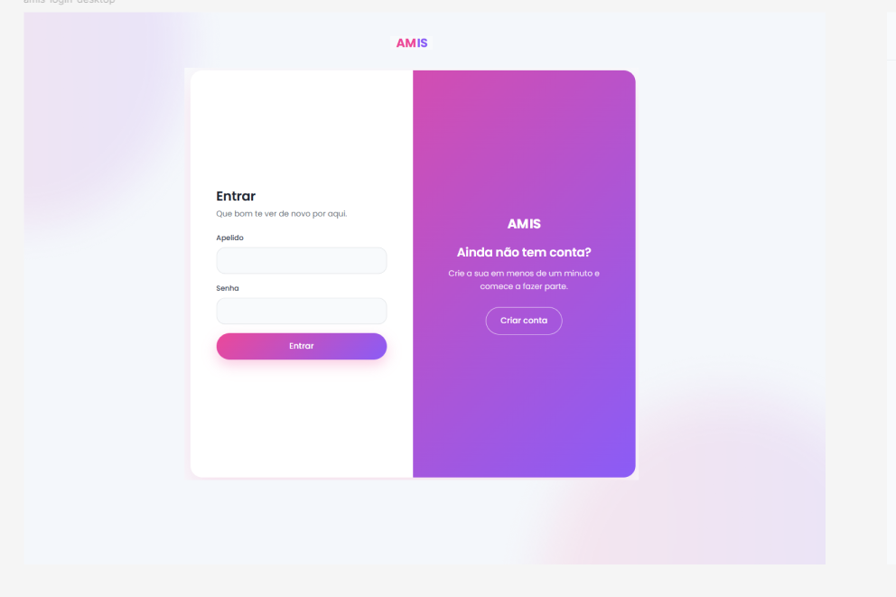
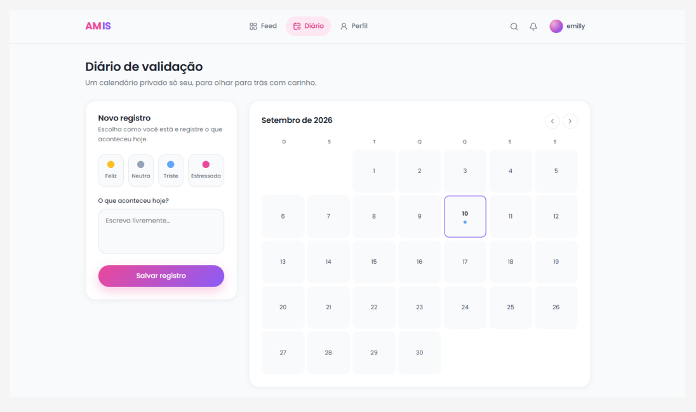
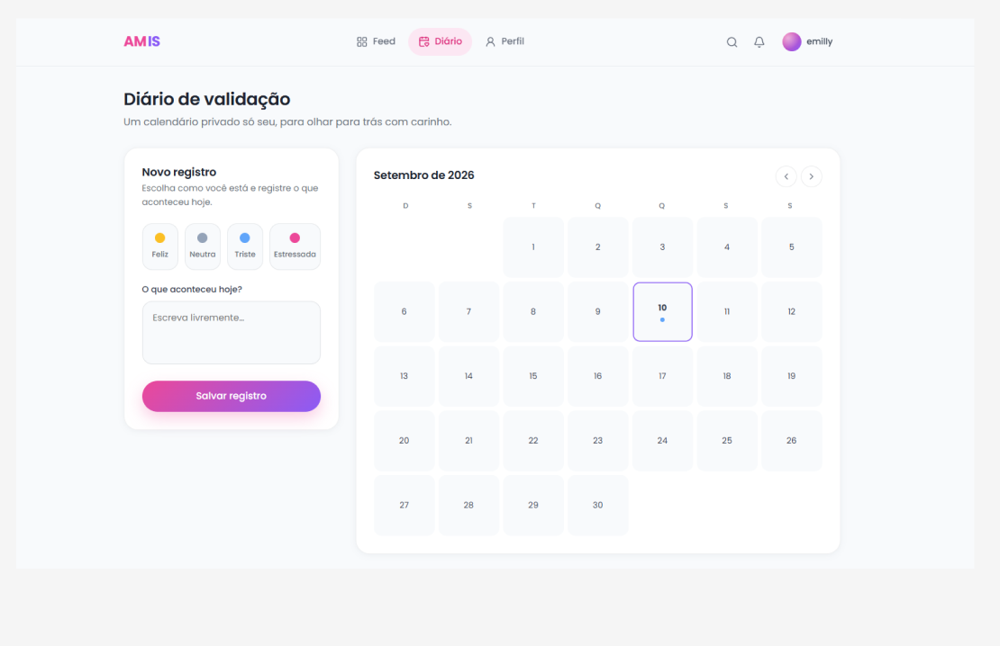
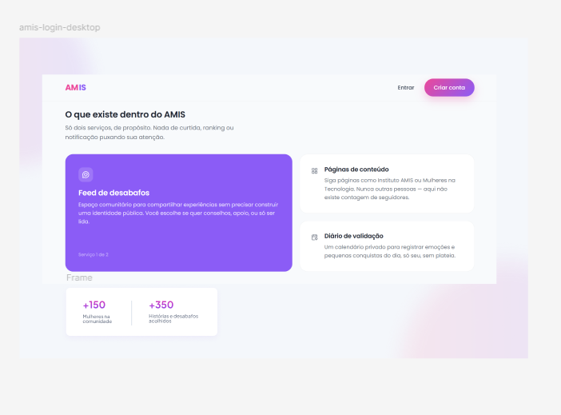
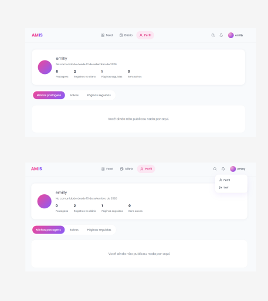

# Plataforma AMIS

O AMIS é uma plataforma feita para o público feminino, criada com a ideia de ser um espaço de acolhimento e troca de experiências sem seguir o modelo tradicional das redes sociais.

A proposta é simples: criar um lugar onde mulheres possam compartilhar histórias, desabafos e conteúdos úteis sem a pressão de seguidores, curtidas ou da necessidade de construir uma imagem perfeita na internet.

O nome AMIS surgiu da junção dos nomes das integrantes do grupo (**AM**anda, E**MI**lly e **IS**abele) e também faz referência à palavra *amis* (amigos, em francês).

Além do feed, a plataforma possui um espaço chamado **Journal**, onde cada usuária pode registrar acontecimentos do passado, do presente ou até planos para o futuro, criando um diário pessoal totalmente privado.

No AMIS, perfis pessoais não possuem qualquer tipo de distinção visual. Não existe conta verificada, selo de popularidade, destaque para pessoas conhecidas ou qualquer identificação que coloque uma usuária acima da outra.

A ideia é que todas sejam vistas da mesma forma, para que o foco esteja nas histórias e nas experiências compartilhadas, e não em quem publicou.

### Descrição

Ao acessar o AMIS pela primeira vez, a usuária encontra uma página inicial não logada, que apresenta uma prévia da plataforma e explica sua proposta. Nessa etapa não é possível visualizar postagens, comentar ou utilizar o Journal. Para acessar essas funcionalidades é necessário fazer login ou criar uma conta.

Durante o cadastro, a usuária escolhe entre dois tipos de perfil:

Perfil pessoal

Nele é possível publicar desabafos, compartilhar experiências, comentar postagens e registrar momentos pessoais dentro do Journal.

Esse perfil pode ser anônimo para as outras pessoas, a identidade não é exibida. O sistema utiliza apenas o e-mail para autenticação da conta.

Perfil de página

Voltado para quem deseja publicar conteúdos sobre um tema específico, como carreira, tecnologia, saúde, autoestima ou qualquer outro assunto relevante. As páginas podem ser seguidas pelas usuárias, diferente dos perfis pessoais.

### Como funciona

Depois do login, a usuária é direcionada diretamente para o feed do AMIS.

O feed reúne publicações de perfis pessoais e de páginas de forma aleatória sem depender de seguidores ou algoritmos.
Isso muda quando a pessoa segue páginas e salva perfis, uma filtragem é feita para aparecer tanto os aleatórios, quanto os dois conteúdos preferidos por ela.

Também é possível:

pesquisar publicações;
filtrar os posts por tema;
acessar rapidamente as páginas seguidas;
visualizar o próprio perfil;
entrar no Journal para registrar o dia.

No **Journal**, a usuária escolhe uma emoção e escreve uma breve descrição para uma data específica, formando um calendário pessoal de lembranças e conquistas.

## Nossa proposta

O AMIS foi pensado para quebrar a ideia de que um perfil “mais bonito”, “mais famoso” ou “mais seguido” vale mais do que outro.

Por isso, perfis pessoais não possuem seguidores. Quando outra usuária gosta da forma como alguém escreve ou se identifica com seus posts, ela pode apenas **salvar aquele perfil** para encontrá-lo novamente depois. A autora nunca saberá que foi salva.

Já as **páginas** podem ser seguidas normalmente, porque seu objetivo é compartilhar um conteúdo especifico.

## Principais funcionalidades

Login e cadastro
Criação de perfil pessoal ou página
Feed de postagens
Comentários em publicações
Posts salvos
Perfis pessoais salvos
Páginas seguidas
Journal (diário privado)
Registro de emoção por data
Pesquisa e filtragem de temas das postagens

### Imagens referen

